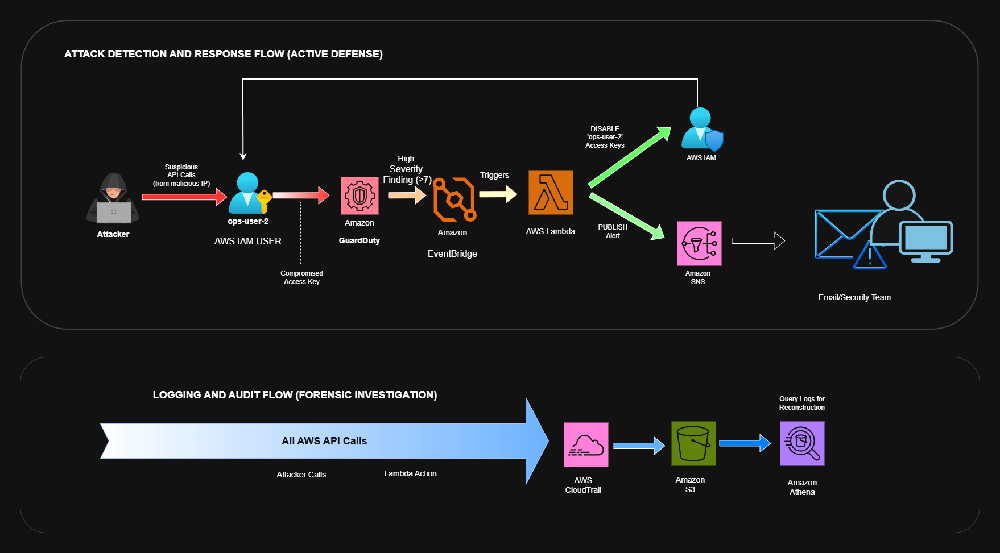
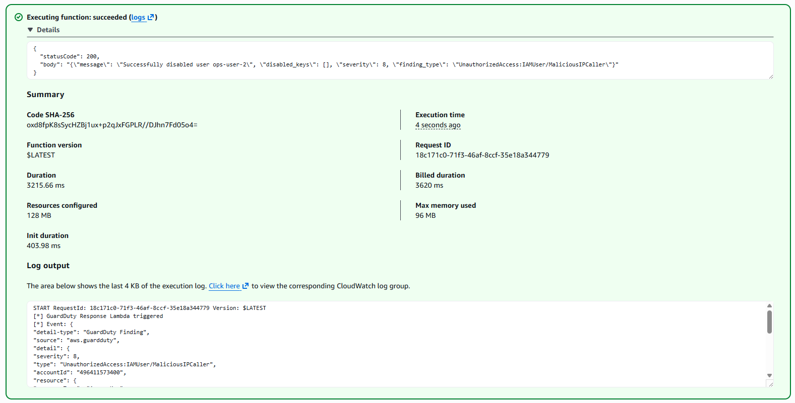
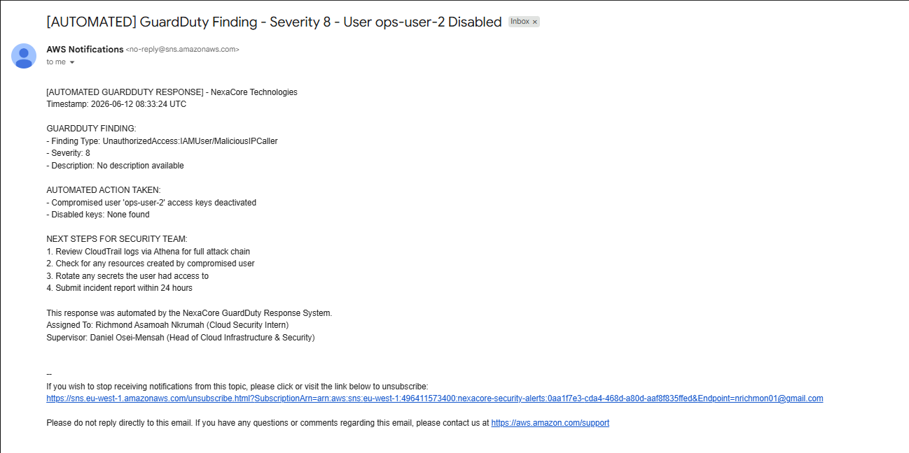
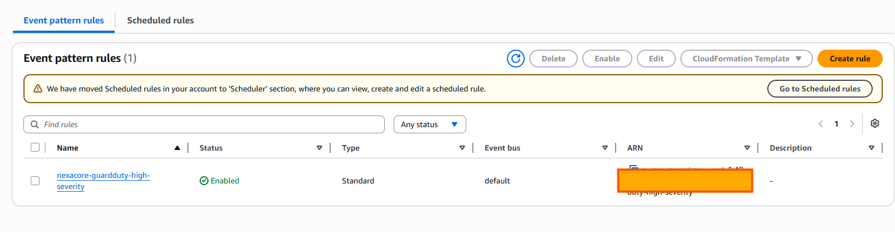
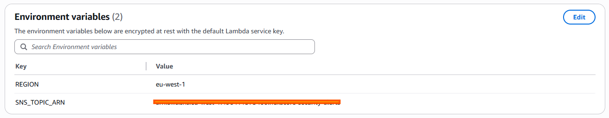
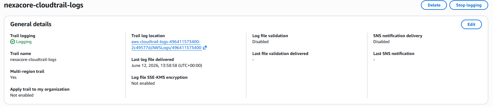

# Project 08 — Automated GuardDuty Incident Response
**Organisation:** NexaCore Technologies  
**Author:** Richmond Asamoah Nkrumah  
**Region:** eu-west-1 | **Account:** 496411573400

---

## Overview
This project implements a fully automated cloud security incident response system on AWS. When GuardDuty detects a high-severity threat, the system automatically disables the compromised IAM user and notifies the security team — all within seconds, no human intervention required.

---

## Architecture

---

## AWS Resources Built

| Resource | Name |
|---|---|
| CloudTrail Trail | nexacore-cloudtrail-logs |
| S3 Bucket | aws-cloudtrail-logs-496411573400-2c49577d |
| Athena Database | nexacore_cloudtrail_db |
| Athena Table | cloudtrail_logs |
| SNS Topic | nexacore-security-alerts |
| Lambda Function | nexacore-guardduty-response |
| EventBridge Rule | nexacore-guardduty-high-severity |
| IAM User (test) | ops-user-2 |

---

## Scripts

| Script | Purpose |
|---|---|
| `scripts/disable_user.py` | Manually disable a compromised IAM user |
| `scripts/investigate_cloudtrail.py` | Query CloudTrail logs via Athena for incident analysis |
| `lambda/guardduty_response.py` | Lambda handler — automated GuardDuty response |

---

## How It Works
1. GuardDuty detects suspicious activity and generates a finding
2. EventBridge rule matches findings with severity ≥ 7
3. Lambda is triggered automatically with the finding details
4. Lambda disables all access keys for the compromised IAM user
5. Lambda publishes an alert to SNS which emails the security team

---

## Evidence

### Lambda Function — Successful Execution

### SNS Alert Email Delivered

### EventBridge Rule — Enabled

### Lambda Environment Variables

### CloudTrail — Active Logging

---

## Test Results
- **Finding Type:** UnauthorizedAccess:IAMUser/MaliciousIPCaller  
- **Severity:** 8  
- **User Disabled:** ops-user-2  
- **Alert Delivered:** Yes — email received via SNS  
- **Response Time:** Under 5 seconds  

---

## Incident Report
See [docs/incident_report_001.md](docs/incident_report_001.md) for the full incident report from the test execution.